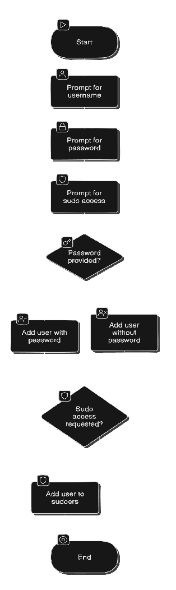

# Adding a New User to a Linux System

## Description

This guide explains how to create a new user on a Linux system using an Ansible playbook. Ansible automates the process of user management, making it easy to handle multiple systems consistently.

## Workflow



## Prerequisites

+ Ansible Installed: Ensure Ansible is installed on your control machine.

+ Target Hosts: Have access to one or more Linux systems where you want to add users.

+ SSH Access: Ensure you can connect to the target hosts via SSH and that you have the necessary permissions.

+ Inventory File: Create an inventory file that lists your target hosts.

## Running the Playbook

First, clone the Ansible configuration repository by running the following command:

https://github.com/ELemenoppee/automation-with-ansible

Change to the add-instance-user directory:

```bash
cd automation-with-ansible/
cd add-instance-user/
```

Open the inventory file for editing:

```bash
vi inventory
```

**Note:** Make sure to replace the placeholder values such as `<REMOTE_IP>` and `<username>` with the appropriate information for your environment.

Run the Ansible playbook with the following command:

```bash
ansible-playbook -i inventory playbook.yaml --ask-pass --ask-become-pass
```

This command will prompt you for the SSH password and the password for privilege escalation if necessary.

