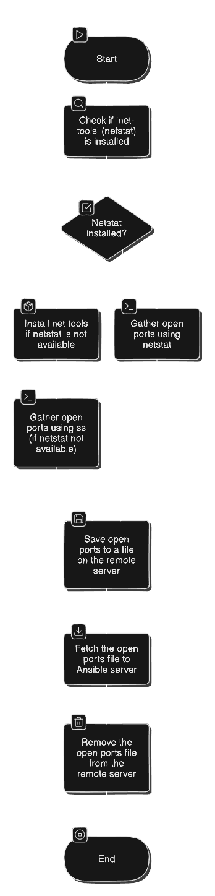

# Gather Open Ports on EC2 Instances Using Ansible

## Description

This guide explains how to use Ansible to gather information about open ports on EC2 instances. By collecting this data, you can monitor which services are running and whether any unintended ports are open, ensuring better security management of your infrastructure.

## Workflow



## Prerequisites

Before running the playbook, ensure the following requirements are met:

+ Ansible Installed: Make sure you have Ansible installed on your control machine.
+ EC2 Instances: Ensure you have EC2 instances running and accessible via SSH.
+ SSH Access: Ensure Ansible can connect to your EC2 instances using SSH keys.

## Running the Playbook :-

First, clone the Ansible configuration repository to your local machine by running the following command:

https://github.com/ELemenoppee/automation-with-ansible

Change into the directory where the playbook for gathering open ports is located:

```bash
cd automation-with-ansible/
cd gather-open-ports-on-ec2-instances/
```

Open the inventory file in a text editor to configure the EC2 instances you want to target. Replace the placeholder values like <REMOTE_IP> and <username> with the actual IP addresses and usernames for your environment:

```bash
vi inventory
```

Execute the playbook using the following command:

```bash
ansible-playbook -i inventory playbook.yaml --ask-become-pass
```

By following these steps, Ansible will collect information about the open ports on your EC2 instances, helping you stay on top of your system’s security.
