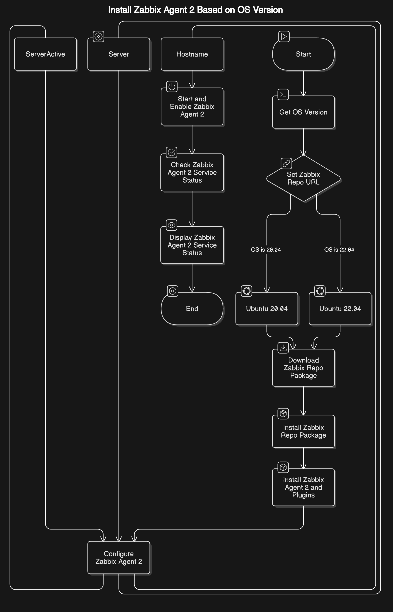

# Install Zabbix Agent 2 Using Ansible



## Description

This Ansible playbook automates the installation and configuration of Zabbix Agent 2 on Ubuntu systems. It determines the operating system version and installs the appropriate Zabbix Agent 2 package for Ubuntu 20.04 (Focal) or 22.04 (Jammy).

## Prerequisites

+ Ansible installed on the control node.
+ Root privileges on the target Ubuntu machines.
+ Target systems running Ubuntu 20.04 or 22.04.

## Steps

Clone the repository

```bash
git clone <repository-url>
cd zabbix-agent-installation
```

Update the Playbook Configuration

Edit the playbook and update the Server and ServerActive fields with the IP address or hostname of your Zabbix server.

```bash
- name: Configure Zabbix Agent 2 - Server
  lineinfile:
    path: /etc/zabbix/zabbix_agent2.conf
    regexp: '^Server='
    line: 'Server=<your-zabbix-server-ip>'
    state: present

- name: Configure Zabbix Agent 2 - ServerActive
  lineinfile:
    path: /etc/zabbix/zabbix_agent2.conf
    regexp: '^ServerActive='
    line: 'ServerActive=<your-zabbix-server-ip>'
    state: present
```

Run the playbook

Use Ansible to execute the playbook:

```bash
ansible-playbook -i <inventory-file> playbook.yml
```

+ Replace <inventory-file> with the path to your Ansible inventory file.

+ Example inventory file:

```bash
[machines]
<REMOTE_IP> ansible_host=<REMOTE_IP> ansible_user=<username>
```

Verify the Installation

At the end of the playbook run, the status of the Zabbix Agent 2 service will be displayed. Example:

```bash
TASK [Display Zabbix Agent 2 service status] ************************************
ok: [192.168.1.10] => {
    "msg": "● zabbix-agent2.service - Zabbix Agent 2
           Loaded: loaded (/lib/systemd/system/zabbix-agent2.service; enabled; vendor preset: enabled)
           Active: active (running) since Mon 2024-11-21 14:00:00 UTC; 5min ago
           Docs: man:zabbix_agent2"
}
```